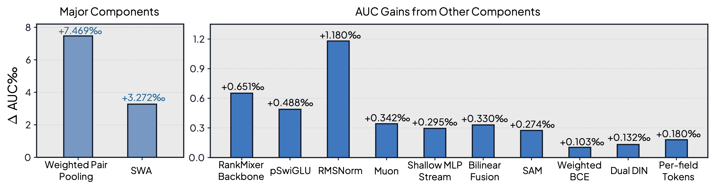
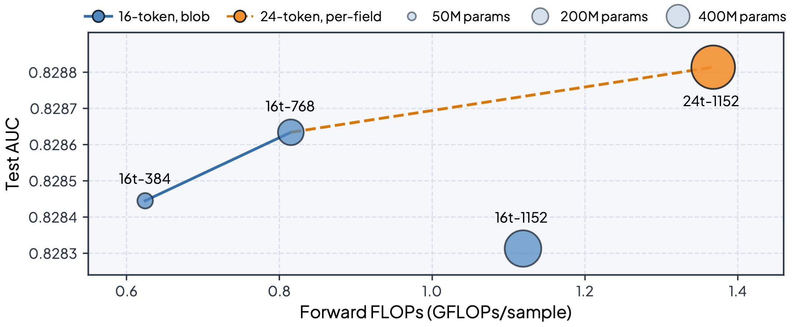

# SeRankMixer

A single-model (non-ensemble) **post-click conversion-rate (pCVR)** ranking network
for the **TAAC 2026 / Tencent UNI-REC** track. It combines a semantically-tokenized
**RankMixer** backbone with target-attention behavior-sequence pooling, a Wide&Deep
shallow side stream fused by **group-wise bilinear interaction**, and a training
recipe built around **Muon + constant-LR SWA + SAM**.

> **Result:** official leaderboard test weighted-AUC **0.828814**, final rank **#9**,
> with a *single* model (no ensembling).

---

## Architecture

The full model — weighted-pair-pooled dense fields, per-field id embeddings, and
DIN-pooled behavior sequences are concatenated, normalized (input BatchNorm +
Channel-SENET), then fed in parallel to a deep **RankMixer** stream and a shallow
**Wide&Deep** stream whose hidden vectors are combined by a **group-wise bilinear
fusion**:

<p align="center"></p>

The two core building blocks — the **RankMixer block** (parameter-free token mixing
+ a per-token pSwiGLU / Swish-gated FFN) and the **weighted pair pooling** (a
`log1p`-weighted average over `(id, weight)` pairs):

<p align="center"></p>

### Components

- **Per-field semantic tokenization.** The dense feature blocks are expanded into
  *one token per field* (big semantic vectors stay independent, small statistic
  fids are merged) instead of being averaged into a couple of "blob" tokens, so
  RankMixer's token mixing can form genuine cross-field interactions.
- **RankMixer backbone** ([arXiv:2507.15551](https://arxiv.org/abs/2507.15551)):
  `L` blocks of *parameter-free* multi-head token mixing + a *per-token* pSwiGLU
  feed-forward network, with RMSNorm. Heads are tied to tokens (`H = T`).
- **Behavior-sequence modeling (DIN).** Each behavior domain is pooled by
  target-attention (DIN). The long domain additionally uses a **dual-window DIN**
  (recent half / older half pooled separately, then concatenated).
- **Weighted-pair pooling.** `(id, weight)` pair fields are pooled by a true
  weighted average (with a `log1p` long-tail transform) rather than a plain mean.
- **Two-stream Wide&Deep + group-wise bilinear fusion**
  ([FinalMLP, arXiv:2304.00902](https://arxiv.org/abs/2304.00902)): a shallow MLP
  on the post-SENET vector produces a parallel logit; the two streams' hidden
  vectors are fused by a zero-init group-wise bilinear residual.

### Training recipe

- **Optimizer split:** weight matrices → **Muon**; norms / biases / heads → AdamW;
  sparse embedding tables → Adagrad. **Constant learning rate** (no scheduler).
- **SWA** (Stochastic Weight Averaging, [arXiv:1803.05407](https://arxiv.org/abs/1803.05407)):
  an equal-weight running mean of the dense weights with a mandatory BatchNorm-stat
  recomputation; the averaged checkpoint is the one used at inference.
- **SAM** (Sharpness-Aware Minimization) for flatter minima, composed with SWA.
- **Weighted BCE** (`pos_weight` up-weighting positives) for the imbalanced label.

---

## Results

On the official TAAC-2026 / KDD Cup 2026 Tencent UNI-REC test set, the model reaches a test
weighted-AUC of **0.828814** (rank **#9**) — a **+14.716‰** total gain over the baseline
(0.814098), with a *single* model.

**Ablation** — incremental, single-variable contribution of each component. **Weighted pair
pooling** (+7.469‰) and **SWA** (+3.272‰) are the two dominant levers:

<p align="center"></p>

**Scaling** — compute–accuracy trade-off (bubble area = dense parameter count). Naively widening
the 16-token blob backbone saturates (768 → 1152 *degrades* despite more parameters); switching
to **24 per-field tokens** lets the larger model pay off and reach the best accuracy:

<p align="center"></p>

---

## Installation

```bash
pip install -r requirements.txt
```

Requires Python 3.9+ and PyTorch 2.x. Multi-GPU training uses `torchrun` (DDP).

## Data format

Training / evaluation data is a directory of **Parquet** files plus a
`schema.json` describing the field layout. Each row carries id features
(`user_int` / `item_int`), dense feature blocks (`user_dense` / `item_dense`),
several behavior sequences, a timestamp, and a label. See `SeRankMixer/dataset.py`
for the exact parsing.

## Training

```bash
cd SeRankMixer
# point the script at your data + output dirs, then:
bash train_scripts/exp-serankmixer-l2-muon-swa-2stream-bilinear-sam-dualdin-d-perfid.sh \
  --data_dir /path/to/train_parquet \
  --schema_path /path/to/schema.json \
  --ckpt_dir /path/to/ckpt \
  --log_dir /path/to/logs
```

The script auto-detects the GPU count and launches single-GPU or DDP accordingly.
It is the configuration that produced the 0.828814 result.

## Inference

`infer.py` reads its checkpoint and data locations from environment variables and
writes `predictions.json`:

```bash
MODEL_OUTPUT_PATH=/path/to/ckpt/<best_step_dir> \
EVAL_DATA_PATH=/path/to/test_parquet \
EVAL_RESULT_PATH=/path/to/output \
python SeRankMixer/infer.py
```

Every structural hyper-parameter is round-tripped from the `train_config.json`
written next to the checkpoint, so inference needs no extra flags.

## Repository layout

```
SeRankMixer/
├── model.py             # the network (RankMixer + DIN + SENET + two-stream bilinear fusion)
├── dataset.py           # Parquet IterableDataset, feature parsing, DDP sharding
├── trainer.py           # training loop, Muon, SWA, SAM, DDP
├── train.py             # CLI entry point
├── infer.py             # inference entry point
├── build_dense_stats.py # long-tail dense statistics
├── utils.py             # misc helpers (early stopping, logging)
└── train_scripts/       # the final submission configuration
```

## References

- RankMixer — *RankMixer: Scaling Up Ranking Models in Industrial Recommenders*, [arXiv:2507.15551](https://arxiv.org/abs/2507.15551)
- FinalMLP — *FinalMLP: An Enhanced Two-Stream MLP Model for CTR Prediction*, [arXiv:2304.00902](https://arxiv.org/abs/2304.00902)
- DIN — *Deep Interest Network for Click-Through Rate Prediction*, [arXiv:1706.06978](https://arxiv.org/abs/1706.06978)
- SWA — *Averaging Weights Leads to Wider Optima and Better Generalization*, [arXiv:1803.05407](https://arxiv.org/abs/1803.05407)
- SAM — *Sharpness-Aware Minimization for Efficiently Improving Generalization*, [arXiv:2010.01412](https://arxiv.org/abs/2010.01412)
- Muon — *Muon: An optimizer for the hidden layers of neural networks*

## License

See [LICENSE](LICENSE).
